boxee.scad
==========

Parametric storage box with lid, created in [OpenSCAD](https://openscad.org/).
Everything is configured from the Customizer — no code editing needed.

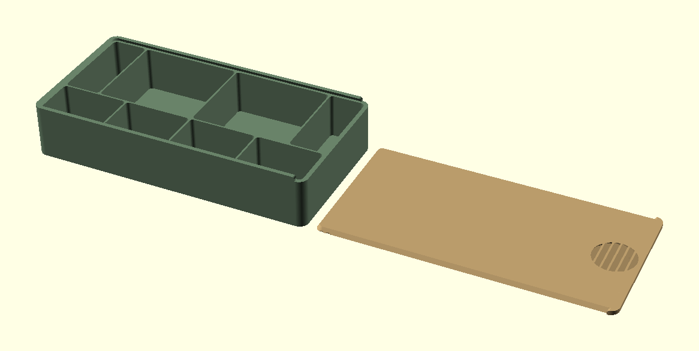

Main features
-------------

- [Compartment layout](#compartments) defined by a simple text string
- 10 [lid types](#lid-types) — friction lip, magnets, latches, hinges, slider
  and their combinations
- [Hinges](#hinges) joined by snap-fit (no hardware), pin, screw with nut or
  self-tapping screw
- [Snap locks](#snap-locks) holding the slider lid and latches closed
- [Magnet closure](#magnets--pausing-the-print) with print-pause support
- Corner [rounding](#rounding), [lid notches](#lid-notches),
  [connection bump/groove](#connection-groove--bump-mini-lip) (mini lip)
- [Dimension summary and hardware "shopping list"](#usage) (screws, pins,
  magnets)

Dependencies
------------

- **OpenSCAD — a recent [development snapshot (nightly)](https://openscad.org/downloads.html#snapshots) is recommended.**
  The 2021.01 stable release works too, but can be very slow with some specific
  parameters.
- **[BOSL2 library](https://github.com/BelfrySCAD/BOSL2)** — use the latest master;
  the hinges rely on recent BOSL2 features. Install it into your OpenSCAD library
  folder as described in the [BOSL2 installation guide](https://github.com/BelfrySCAD/BOSL2?tab=readme-ov-file#installation)
  (find the folder via *File ▸ Show Library Folder* in OpenSCAD).

Usage
-----

1. Open `main.scad` in OpenSCAD and show the Customizer (*Window ▸ Customizer*).
2. Define compartments and pick a lid type (see below). Every parameter has a
   description in the Customizer.
3. Preview (F5), render (F6), export STL. All parts are laid out side by side in
   print orientation.

The console (and a summary plate under the model in preview) reports the outside
dimensions, the hardware you need (screws, pins, magnets) and print-pause heights
for magnet closures.

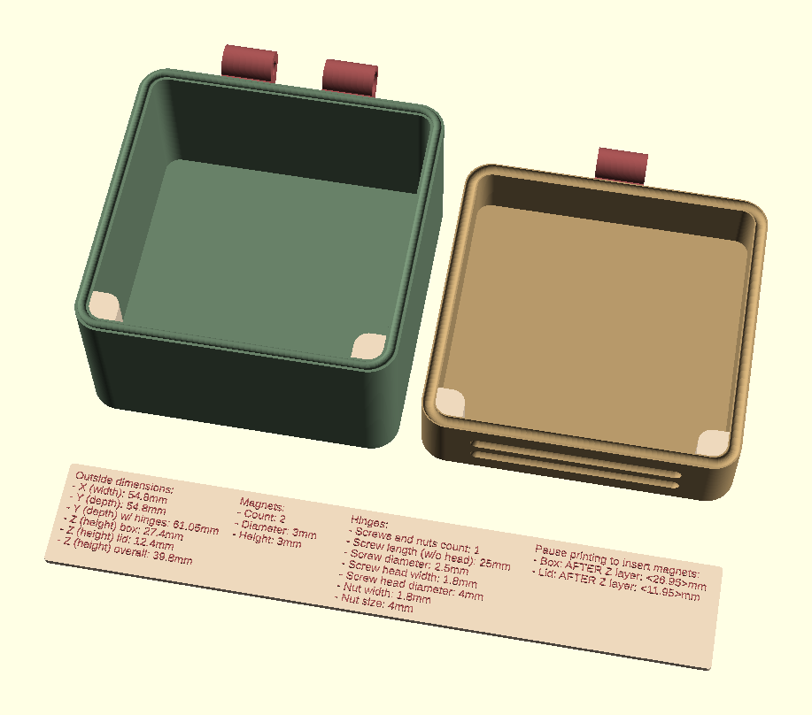

Examples
--------

The [examples](examples) folder contains three ready-to-print projects, each
with the STL and photos of the printed result:

- **[Medi box](examples/medi_box)** — medical box with a slider lid and
  compartments sized for pill bottles; the cross-shaped notches on the lid make
  opening easier (the healthcare symbol visible on the walls in the photo is a
  negative volume added in the slicer software).
- **[Hardware box](examples/hardware_box)** — organizer for small screws and
  nuts, hinged together and lockable by a latch with snap lock.
- **[Tool box](examples/tool_box)** — box for iFixit tools with a lip and
  magnetic lid (the screwdriver pattern visible on the lid in the photo was
  added in the slicer software).

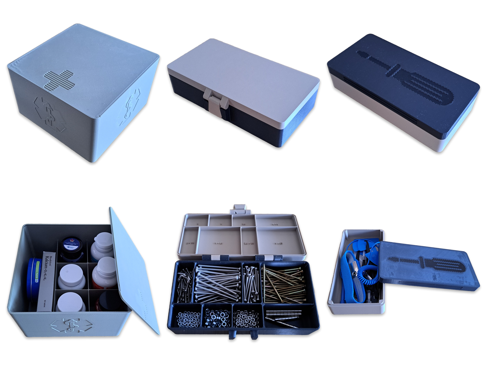

Compartments
------------

Compartments are defined by the text parameter `compartments_dimensions`.
Each row is `DEPTH, WIDTH, WIDTH, ...` — the first number is the row depth (Y),
followed by the widths (X) of its compartments. Rows are separated by `;`.
The box size is derived from the compartments plus wall/separator thickness —
`"50, 50"` gives a single 50×50 mm compartment.

`"50, 20, 55, 55, 20; 25, 37.5, 37.5, 37.5, 37.5"` — two rows: a 50 mm deep row
with four compartments and a 25 mm deep row with four equal ones.

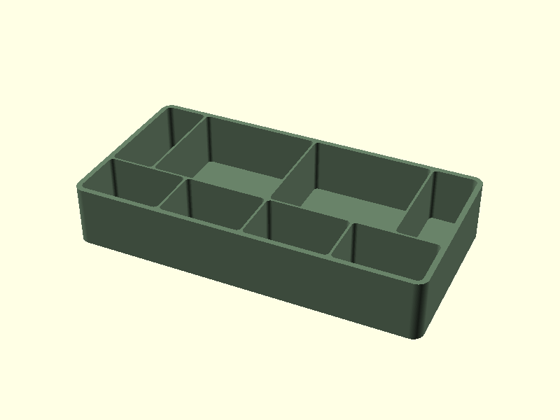

`compartments_transpose = true` — same definition, rows run along X instead of Y.

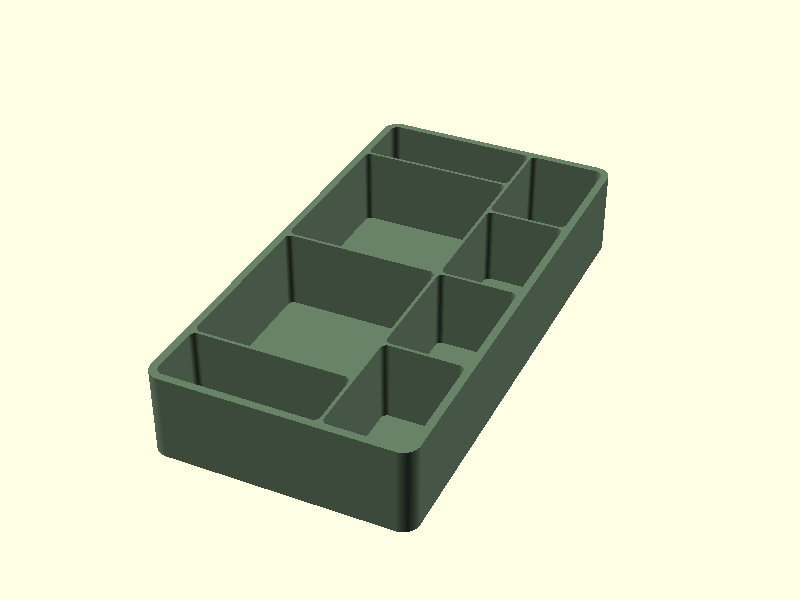

`separators_z_offset = 15` — separators lowered from the top, leaving shared
space above the compartments.

`separators_inside_lid = true` — matching separators are also generated inside
the lid (any lid type except slider).

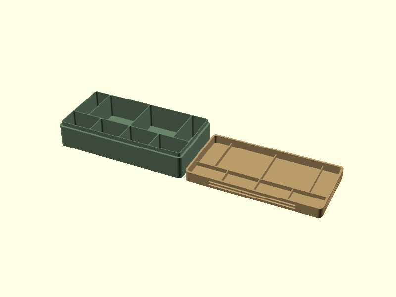

Lid types
---------

Selected by `lid_type`. Box is always printed as one part; the lid (and latches)
are separate parts laid out next to it.

**No lid** (`no_lid`) — open tray.

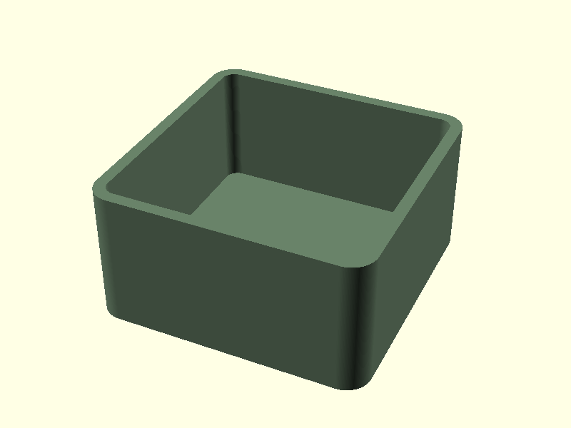

**Lip** (`lip`) — inner lip on the box, the lid holds by friction. Tune the fit
with `lip_tolerance` (lower = tighter).

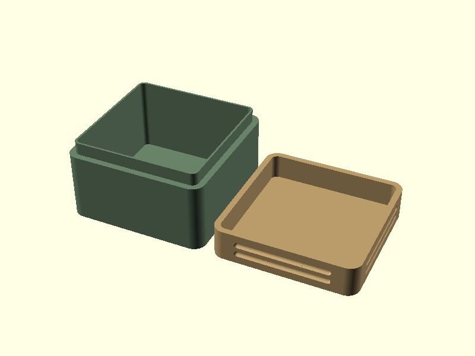

**Magnets** (`magnets`) — flat mating faces with 2 or 4 magnet pairs in corner
holders. See [Magnets](#magnets--pausing-the-print).

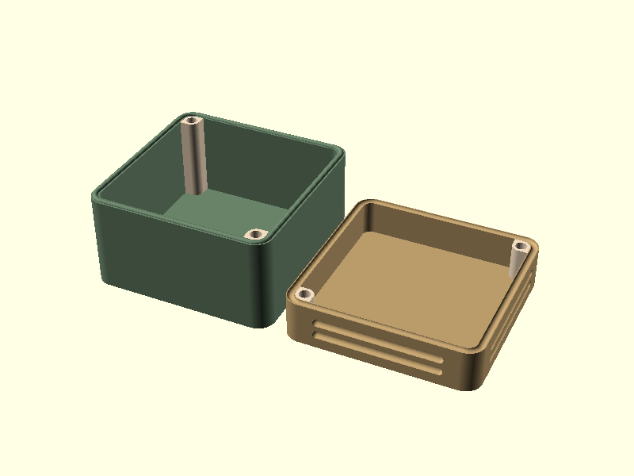

**Lip and magnets** (`lip_magnets`) — lip aligns the lid, magnets hold it closed.

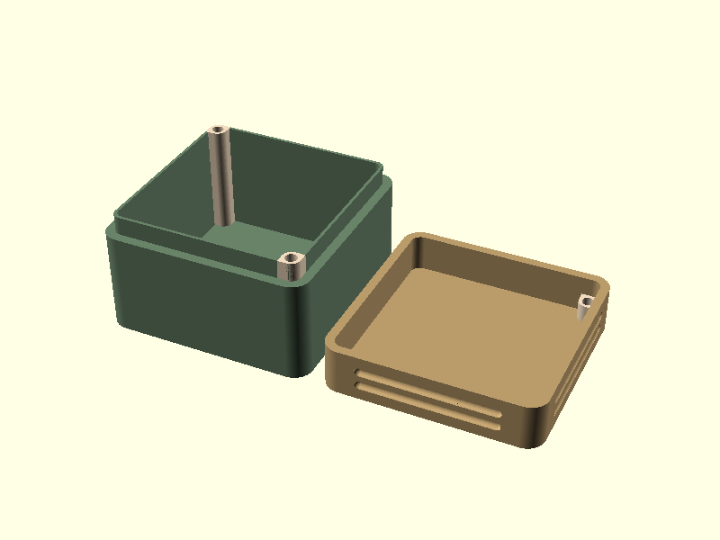

**Latches** (`latches`) — dovetail latches on the front and back. The latch
swings on a snap-fit hinge and clicks onto the box.

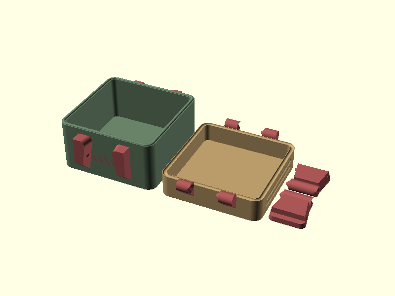

**Lip and latches** (`lip_latches`) — friction lip plus latches.

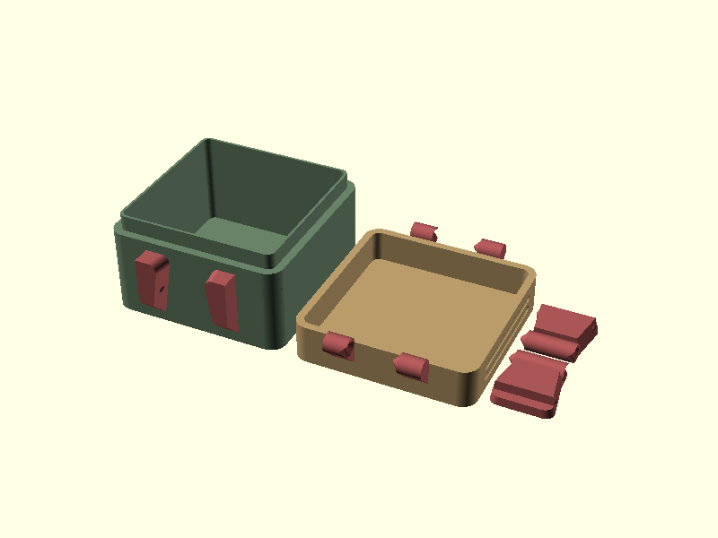

**Hinges** (`hinges`) — lid hinged at the back, nothing holds the front closed.

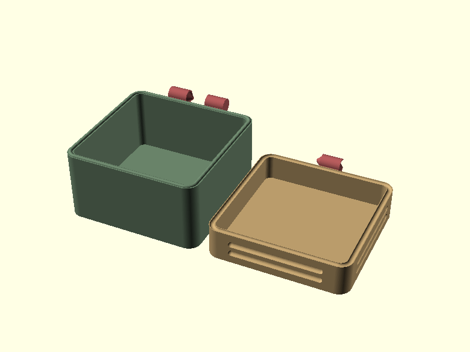

**Hinges and magnets** (`hinges_magnets`) — hinged lid held closed by magnets
(with 2 magnets both sit at the front edge).

**Hinges and latches** (`hinges_latches`) — hinged lid with latches at the
front only.

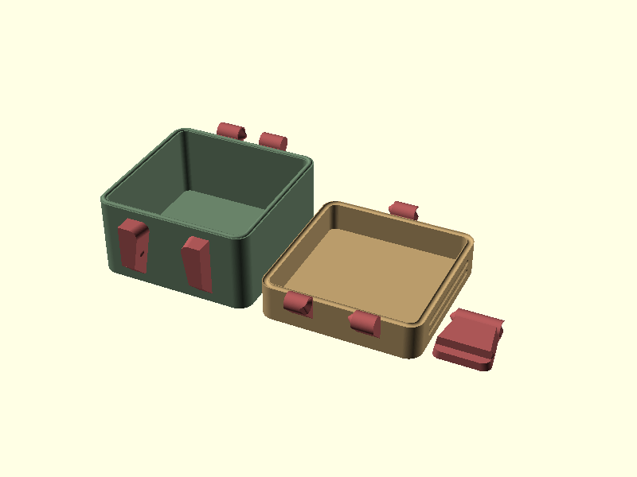

**Slider** (`slider`) — flat lid slides into side rails, with optional snap lock
and a notch pattern for grip.

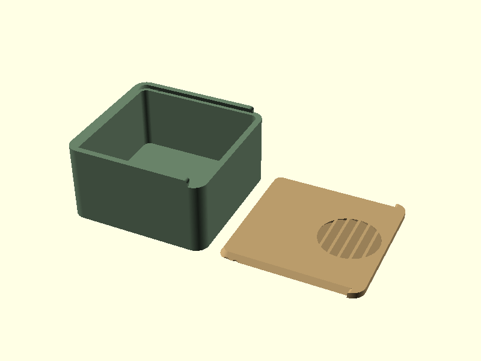

Hinges
------

`hinge_join_type` selects how the hinge halves (one printed on the box, one on
the lid) are joined.

**Snap-fit** (`snap_fit`) — no hardware. Built-in cones on one half click into
sockets on the other; assembled by pressing together after printing. Needs ≥ 3
segments.

**Simple pin** (`pin`) — plain hole through the knuckles. Use a nail, rod or a
piece of 1.75 mm filament as the pin.

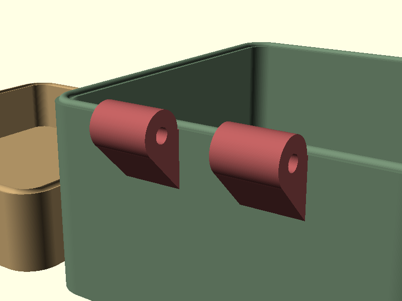

**Screw with nut** (`screw_nut`) — through hole with a counterbore for a flat
screw head on one end and a hex recess for the nut on the other.

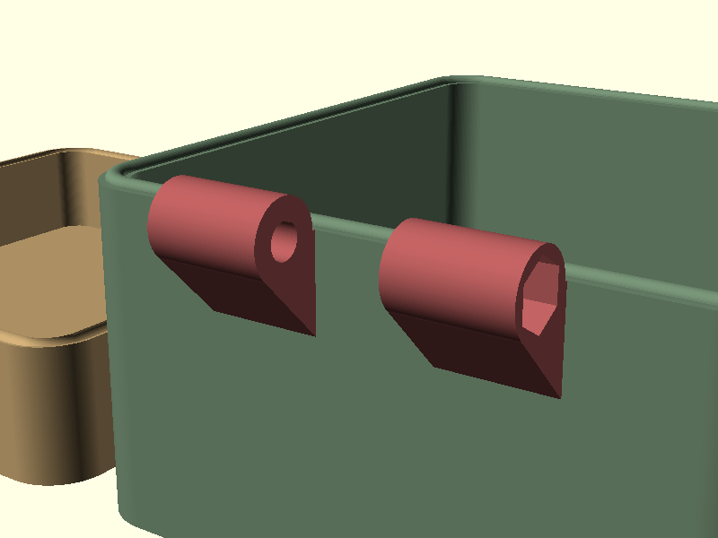

**Self-tapping screw** (`screw_self_tap`) — countersink for the conical head;
the hole in the last segment is undersized so the screw taps into it.
ISO (M1.6–M6) and UTS (#0–#12) sizes.

Rounding
--------

`corner_outer_radius` and `corner_inner_radius` round the box/lid corners,
`compartment_bottom_radius` rounds the compartment floors (slow to render).

| Sharp (`0` / `0` / `0`) | Rounded (`10` / `20` / `10`) |
|---|---|
| 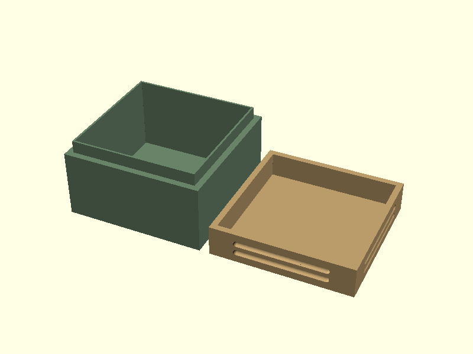 | 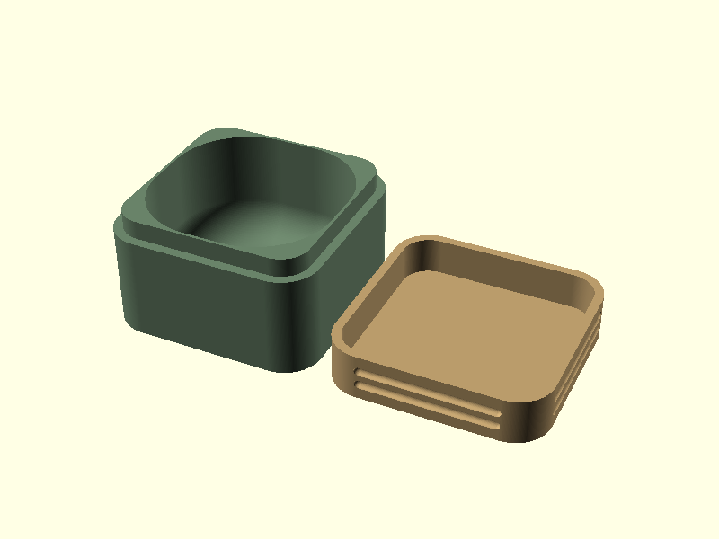 |

Lid notches
-----------

Shallow finger grooves on the lid sides make the lid easier to grip and open.
Configure the sides (`lid_notches`: X / Y / both / none), the number of grooves
and their spacing. Sides carrying hinges or latches are skipped automatically.

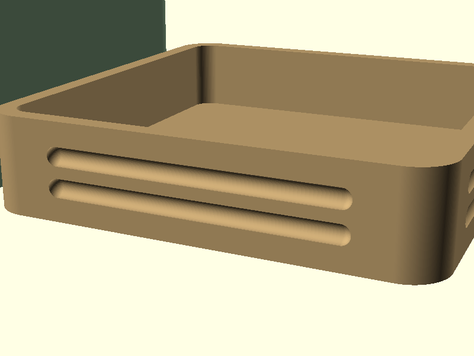

Slider lid notches
------------------

The slider lid can carry a decorative grip pattern (`slider_lid_notches`):
full-width ribs or ribs clipped to a shape — circle, triangle, square, hexagon,
teardrop, cross or heart. Number, width, spacing, depth and position of the ribs
are configurable.

Connection groove / bump (mini lip)
-----------------------------------

For flat-faced lids (magnets, latches, hinges — without a lip), a small bump on
one rim can mate with a groove on the other. It aligns the lid and adds a light
hold. Choose which part gets the bump
(`connection_type`) and size both as a percentage of the wall thickness;
`connection_height_percentage` flattens the profile. Shown below with 4 mm
walls for visibility.

| Bump on the box rim | Groove around the lid rim |
|---|---|
| 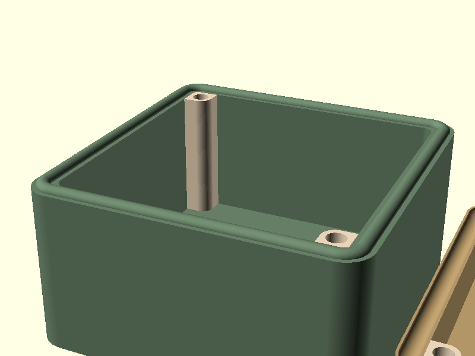 | 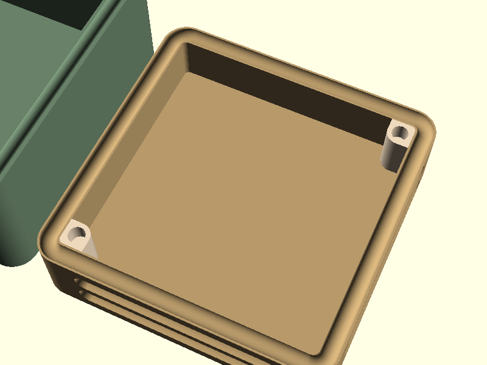 |

Snap locks
----------

Both the slider lid and the latches can click shut:

- **Slider** — `slider_lid_snap_lock` adds small bumps at the ends of the box
  rails that snap into matching recesses in the lid, so the closed lid holds
  position with a click. `slider_lid_snap_lock_firmness` (0–1) scales the bumps.
- **Latches** — `latch_snap_lock` adds bumps that click into recesses in the
  latch seat on the box, keeping the latch closed. `latch_snap_lock_firmness`
  (0–1) scales them.

Both are tuned for the default tolerance of 0.1 mm — if you change
`slider_lid_tolerance` or `latch_tolerance`, you may need to adjust the
corresponding firmness.

Magnets & pausing the print
---------------------------

Magnet holders are printed into the corners of the box and lid. Holes are sized
from `magnet_diameter` / `magnet_height` plus `magnet_tolerance`, with
`magnet_glue_height` of extra depth for glue.

- **Default** (`magnet_generate_closure = false`): holes are open at the mating
  face — print normally, then glue the magnets in.
- **Closed holes** (`magnet_generate_closure = true`): a thin layer
  (`magnet_closure_height`) covers each hole, so the magnets must be inserted
  *during* the print. You have to **pause the print** at the right layer for both
  the box and the lid — the exact heights are echoed to the console and shown on
  the summary plate (e.g. `Box: AFTER Z layer: <26.95>mm`). In PrusaSlicer, add
  the pause with *Insert pause* at that layer — see
  [Prusa's guide](https://help.prusa3d.com/article/insert-pause-or-custom-g-code-at-layer_120490).

Double-check magnet polarity before inserting: every box/lid pair must attract.

Other features
--------------

- Every fit has its own tolerance parameter — lip, slider, magnets, latches,
  hinge pin and screw hardware.
- The interior height is split between box and lid by `bottom_height` /
  `lid_height`; wall thickness (`thickness`) and separator thickness
  (`separator_thickness`) are independent.
- Hinges: count, segment count and length ratio, knuckle diameter and arm angle
  are configurable; `hinge_flip_last` mirrors the last hinge for easier
  screwdriver access or a symmetric pair.
- Latches: count, size and the angles of the support and hinge arm are
  configurable.
- `model_detail_preview` / `model_detail_render` trade speed for smoothness
  separately in preview and in the final render.

License
-------

[CC BY-SA 4.0](LICENSE.txt)
